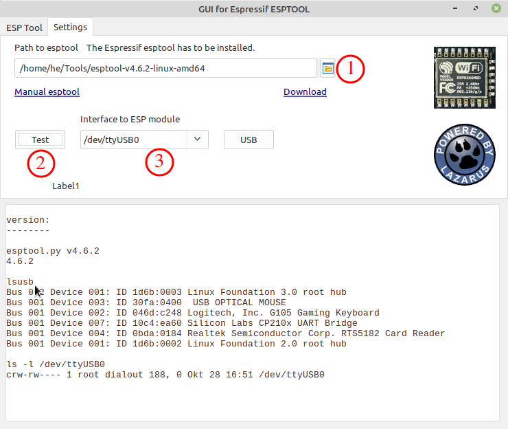

# ESPflasher
This is a GUI for the famous esptool that covers only important commands to flash binary files to an ESP8266. It should help people to flash binary files that not want to deal with terminal commands an want to get fast and easy results.
This tool should be self-explained. All controls will show hints to explain what it is for.
Of course, esptool from Espressif have to be installed.

Only tested with ESP8266.
